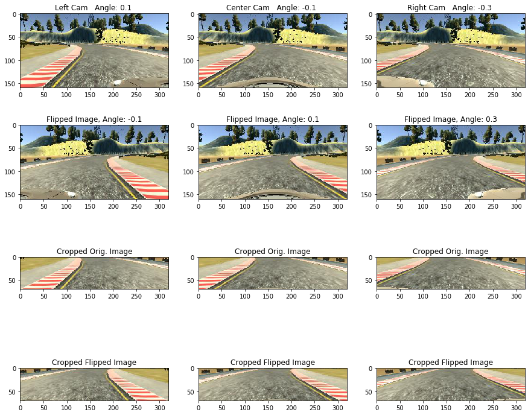

# SDC-behavioral-cloning
The goal of this project is to train a convolutional nueral net to generate the correct steering angles form training data. Note that eventhough the car drives autonomously on test track, the only prediction the nueralnet is making is the 'steering angle'. It will be interesting to further develop this idea to include to generate other required parameters like throttle which may require  a combination of sensor data and machine learning.  

Key steps of this pipeline are:
* Collect drving data from the simulator in training mode
* Augment data set by including images from left and right cameras and flipping images
* Build a image processing pipeline involving cropping and normalizing
* Build a CNN in keras with generators to flip and crop the image on the fly 
* Train and validate the model
* Test the car by running it in autonomous mode 

[//]: # (Image References)

[image1]: ./examples/undistort_output.png "Undistorted"
[image2]: ./test_images/test1.jpg "Road Transformed"
[image3]: ./examples/binary_combo_example.jpg "Binary Example"
[image4]: ./examples/warped_straight_lines.jpg "Warp Example"
[image5]: ./examples/color_fit_lines.jpg "Fit Visual"
[image6]: ./examples/example_output.jpg "Output"
[video1]: ./project_video.mp4 "Video"

---
###Code

Run the python notebook `behavioral_cloning.ipynb` to implement the Keras model and . Implementation consists of the following files located in the source directory

* behavioral_cloning.ipynb          -   Implements CNN model and processing pipeline   
* drive.py                          -   Generates the steering angle predictions in autonomous mode
* model.h5                          -   Saved CNN model
* out_videos                        -   Folder with car driving in autonomous mode at multiple speeds
* writeup.md                        -   You are reading it

Recordings of driving in autonomous mode are available in the folder `out_videos`. The simulator i downloaded had a speed set to 9mph. Uploaded are videos in autonomous mode at speeds 9mph and 15 mph.

The actual model is implemented in `behavioural cloning.ipynb`. This file also contains data augmenting and processing routines.

###Model Architecture and Training Strategy

The model architecture is similar to the architecture proposed [here by NVIDIA](http://images.nvidia.com/content/tegra/automotive/images/2016/solutions/pdf/end-to-end-dl-using-px.pdf). This architecture has been demonstrated to work in real world setting and seems to have generated reasonably good results. Hence this network was chosen as the starting point. However, since our track and lane conditions are much simpler, the depth of the network and the nodes at each layer were reduced. As described below, the final model consists of 4 convolutional layers with 3x3 convolution windows. Relu activation and 2x2 max pooling is applied after each conv. layer. Finally 3 FC layers with dropout are utilized to estimate the output of steering angle. Most of the parameters such as window sizes, learning rate were finalized based on empirical data. 

The augmented data set was split into training and validation sets. Training and validation losses were monitored to ensure that the model is not overfitting the data. To better generalize, the driving data that was collected was augmented to reduce the driving biases associated with the data set. Also, dropout was used in the dense layers toward the output. It was also observed that 10 epochs of training are sufficient to run the car reasonably well in autonomous mode. There is room for a lot more optimization both in terms of augmenting the data and the model which will be done in the future.

The car runs easily at the default speed setting of 9 mph in the model. It also runs well at 15mph without crossing either of the lane boundaries. While there is a bit of moving sideways between the lanes and during the edges, this was primarily due to how the data was captured. The original data was captured at the fastest speed and did not necessarily keep the car always centered. This is another optimization that can be done easily in the near future.

###Final Model Architecture

The final model architecture is located in the file `behavioural cloning.ipynb` and is shown below. It consists of 4 convolution layers followed by 3 FC layers. Each convolution layers is followed by a Relu activation layers and a max pooling layer. A lamda layer that takes the cropped images and 

```python
    #Keras model
    from keras.models import Sequential
    from keras.layers import Dense, Dropout, Activation, Convolution2D, core, convolutional, MaxPooling2D, Lambda, Flatten

    model = Sequential()

    #Original image (160, 320, 3).. With cropping (70,320)
    model.add(Lambda(lambda x : (x-127.5)/127.5, input_shape = (70,320,3)))

    #adds 16 3x3 filters on input and a 2x2 max pooling
    #output after conv. is 16@68x318, after pooling 16@34x159
    model.add(Convolution2D(16,3,3))
    model.add(Activation('relu'))
    model.add(MaxPooling2D(pool_size=(2,2)))

    #output after conv. is 24@32x157, after pooling 24@16x78        
    model.add(Convolution2D(24,3,3))
    model.add(Activation('relu'))
    model.add(MaxPooling2D(pool_size=(2,2)))
          
    #output after conv. is 32@14x76, after pooling 32@7x38          
    model.add(Convolution2D(32,3,3))
    model.add(Activation('relu'))
    model.add(MaxPooling2D(pool_size=(2,2)))

    #output after conv. is 64@5x36, after pooling 64@2x18          
    model.add(Convolution2D(64,3,3))
    model.add(Activation('relu'))
    model.add(MaxPooling2D(pool_size=(2,2)))
          
    #output is 64X2X18 = 2304          
    model.add(Flatten())
    model.add(Dense(300, activation = 'relu'))
    model.add(Dropout(0.5))
    model.add(Dense(100, activation = 'relu'))
    model.add(Dropout(0.5))
    model.add(Dense(10, activation = 'relu'))
    model.add(Dense(1))

```
Here is a visulation of network and output from the model that shows the parameters in each layer. In total there are ~750K parameters that are trained. 

```python
____________________________________________________________________________________________________
Layer (type)                     Output Shape          Param #     Connected to                     
====================================================================================================
lambda_1 (Lambda)                (None, 70, 320, 3)    0           lambda_input_1[0][0]             
____________________________________________________________________________________________________
convolution2d_1 (Convolution2D)  (None, 68, 318, 16)   448         lambda_1[0][0]                   
____________________________________________________________________________________________________
activation_1 (Activation)        (None, 68, 318, 16)   0           convolution2d_1[0][0]            
____________________________________________________________________________________________________
maxpooling2d_1 (MaxPooling2D)    (None, 34, 159, 16)   0           activation_1[0][0]               
____________________________________________________________________________________________________
convolution2d_2 (Convolution2D)  (None, 32, 157, 24)   3480        maxpooling2d_1[0][0]             
____________________________________________________________________________________________________
activation_2 (Activation)        (None, 32, 157, 24)   0           convolution2d_2[0][0]            
____________________________________________________________________________________________________
maxpooling2d_2 (MaxPooling2D)    (None, 16, 78, 24)    0           activation_2[0][0]               
____________________________________________________________________________________________________
convolution2d_3 (Convolution2D)  (None, 14, 76, 32)    6944        maxpooling2d_2[0][0]             
____________________________________________________________________________________________________
activation_3 (Activation)        (None, 14, 76, 32)    0           convolution2d_3[0][0]            
____________________________________________________________________________________________________
maxpooling2d_3 (MaxPooling2D)    (None, 7, 38, 32)     0           activation_3[0][0]               
____________________________________________________________________________________________________
convolution2d_4 (Convolution2D)  (None, 5, 36, 64)     18496       maxpooling2d_3[0][0]             
____________________________________________________________________________________________________
activation_4 (Activation)        (None, 5, 36, 64)     0           convolution2d_4[0][0]            
____________________________________________________________________________________________________
maxpooling2d_4 (MaxPooling2D)    (None, 2, 18, 64)     0           activation_4[0][0]               
____________________________________________________________________________________________________
flatten_1 (Flatten)              (None, 2304)          0           maxpooling2d_4[0][0]             
____________________________________________________________________________________________________
dense_1 (Dense)                  (None, 300)           691500      flatten_1[0][0]                  
____________________________________________________________________________________________________
dropout_1 (Dropout)              (None, 300)           0           dense_1[0][0]                    
____________________________________________________________________________________________________
dense_2 (Dense)                  (None, 100)           30100       dropout_1[0][0]                  
____________________________________________________________________________________________________
dropout_2 (Dropout)              (None, 100)           0           dense_2[0][0]                    
____________________________________________________________________________________________________
dense_3 (Dense)                  (None, 10)            1010        dropout_2[0][0]                  
____________________________________________________________________________________________________
dense_4 (Dense)                  (None, 1)             11          dense_3[0][0]                    
====================================================================================================
Total params: 751,989
Trainable params: 751,989
Non-trainable params: 0
____________________________________________________________________________________________________

```

Here is a visualization of the architecture (note: visualizing the architecture is optional according to the project rubric)


3. Creation of the Training Set & Training Process

Data was captured from the simulator in training mode and augmented. Total data set includes
1) three laps of center driving on the original track  2) two laps of driving in reverse and 3) one lap of recovery. Data collection is oen of the most important parts of this project. One of the experiments that was to capture the data while driving the car at the maximum speed which meant that the corners were not taken at the middle of the road, but closer to the edge like in the real world. This results in the car behaving very similarly in autonomous mode as well. The car comes close to the edges while taking a turn but stays within lanes. 

While there is a lot of driving straight that results neutral steering angle, this data was still kept in the dataset without reducing it. Since this seems to be a valid real world scenario (lot of straight driving as opposed to curves), effort was made to keep the training data as-is and generalize the model using other techniques instead (reverse driving, lr flip, dropout).

Data was augmented in two ways
1) Inculding images from both the left and right cameras in the data set. Steering angle correction was left and right cameras was kept at 0.2 degrees. 
2) Flipping each image along the vertical axis

```python
    camera_adjust_angle = 0.2

    with open(csv_file, 'r') as f:
        reader = csv.reader(f)    
        for row in reader:
            steering_center = float(row[3])
            steering_left = steering_center + camera_adjust_angle
            steering_right = steering_center - camera_adjust_angle        
```

Flipping images is implemented using the numpy function `fliplr()`

```python
    def flip_imgs(orig_imgs, orig_meas):
        new_imgs = [np.fliplr(image) for image in orig_imgs]
        new_meas = [-1*meas for meas in orig_meas]
        return new_imgs,new_meas
```

All the images are then cropped on the top and bottom portions of the image so that only the road section is passed through the model

```python
    def crop_imgs(orig_imgs, crop_htop=70, crop_hbot=140): 
        new_imgs = [image[crop_htop:crop_hbot,:,:] for image in orig_imgs]        
        return new_imgs
```

Shown below are the original images from the left, center and right cameras captured in simulation mode. Note that the steering angles are empirically set to an offset of 0.2deg in either direction. THe next row shows augmented data by flipping each of the image across the horizontal axis. THe bottom two rows show the cropped versions of the rows above so that only the road area that is of interest is preserved.



The images are read in batches using a generator. This means that the memory requirements are greatly simplified. In addition, flipping the images is accomplished in the generator itself rather than processing it before hand and saving them. 

Generator is implemented in the function `generator_images()`

After the data is augmented, total dataset comprised of ~18K images. The data set was split into training and validation sets at 80/20 ratio after random shuffling.

***** Dataset including left and right cameras **********
    Total images   : 18537
    Training Set   : 14829 
    Validation Set : 3708                     
*********************************************************

The network was run for 10 epochs anf Adam optimizer was used with a modified learning rate of 0.0001. This is observed  to result in slightly better validation performance than the default learning rate.

###Video Output

Here are links to the [video output](./output_videos/adv_lane_track.mp4). Another version with slower speed is shown [here](./output_videos/adv_lane_track1.mp4). 

---

###Discussion and further work
This project is a good introduction to Keras and CNN's. Many improvements can be seen, but most of them primarily result from collecting better training data and augmenting. The CNN model seems quite robust and capable of learning complex non-linear functions as demonstrated in the NVIDIA study mentioned above. The goal going forward is to implement a more complex network and run it on data collected in the real world.
